# Backend and Frontend Template

Latest version: https://git.chalmers.se/courses/dit342/group-00-web

This template refers to itself as `group-00-web`. In your project, use your group number in place of `00`.

## Project Structure

| File        | Purpose           | What you do?  |
| ------------- | ------------- | ----- |
| `server/` | Backend server code | All your server code |
| [server/README.md](server/README.md) | Everything about the server | **READ ME** carefully! |
| `client/` | Frontend client code | All your client code |
| [client/README.md](client/README.md) | Everything about the client | **READ ME** carefully! |
| [docs/DEPLOYMENT.md](docs/DEPLOYMENT.md) | Free online production deployment | Deploy your app online in production mode |
| [docs/LOCAL_DEPLOYMENT.md](docs/LOCAL_DEPLOYMENT.md) | Local production deployment | Deploy your app local in production mode |

## Requirements

The version numbers in brackets indicate the tested versions but feel free to use more recent versions.
You can also use alternative tools if you know how to configure them (e.g., Firefox instead of Chrome).

* [Git](https://git-scm.com/) (v2) => [installation instructions](https://www.atlassian.com/git/tutorials/install-git)
  * [Add your Git username and set your email](https://docs.gitlab.com/ce/gitlab-basics/start-using-git.html#add-your-git-username-and-set-your-email)
    * `git config --global user.name "YOUR_USERNAME"` => check `git config --global user.name`
    * `git config --global user.email "email@example.com"` => check `git config --global user.email`
  * > **Windows users**: We recommend to use the [Git Bash](https://www.atlassian.com/git/tutorials/git-bash) shell from your Git installation or the Bash shell from the [Windows Subsystem for Linux](https://docs.microsoft.com/en-us/windows/wsl/install-win10) to run all shell commands for this project.
* [Chalmers GitLab](https://git.chalmers.se/) => Login with your **Chalmers CID** choosing "Sign in with" **Chalmers Login**. (contact [support@chalmers.se](mailto:support@chalmers.se) if you don't have one)
  * DIT342 course group: https://git.chalmers.se/courses/dit342
  * [Setup SSH key with Gitlab](https://docs.gitlab.com/ee/ssh/)
    * Create an SSH key pair `ssh-keygen -t ed25519 -C "email@example.com"` (skip if you already have one)
    * Add your public SSH key to your Gitlab profile under https://git.chalmers.se/profile/keys
    * Make sure the email you use to commit is registered under https://git.chalmers.se/profile/emails
  * Checkout the [Backend-Frontend](https://git.chalmers.se/courses/dit342/group-00-web) template `git clone git@git.chalmers.se:courses/dit342/group-00-web.git`
* [Server Requirements](./server/README.md#Requirements)
* [Client Requirements](./client/README.md#Requirements)

## Getting started

```bash
# Clone repository
git clone git@git.chalmers.se:courses/dit342/group-00-web.git

# Change into the directory
cd group-00-web

# Setup backend
cd server && npm install
npm run dev

# Setup frontend
cd client && npm install
npm run serve
```

> Check out the detailed instructions for [backend](./server/README.md) and [frontend](./client/README.md).

## Visual Studio Code (VSCode)

Open the `server` and `client` in separate VSCode workspaces or open the combined [backend-frontend.code-workspace](./backend-frontend.code-workspace). Otherwise, workspace-specific settings don't work properly.

## System Definition (MS0)

### Purpose

The aim of our project is to create a website where users can share and view recipes essentially. Viewers will need to sign, create an account or sign in with google. Then users are free to browse our catalog of recipes. Each recipe has numerous descriptive elements we call “tags'' that inform users who are viewing a recipe what it contains. Example tags could be “vegan”, “breakfast”,”cheap” etc. Moreover users can review recipes with both free text and a star system rating. 

### CRUD operations
Create: Users will be able to create recipes, reviews, preferences and a favorites recipe list.

Read: Provide users with recipes to view using the cards design pattern where users browse, search and filter them.
Moreover, users can view other users' accounts.

Update: Users will have the ability to edit their recipes, reviews, and preferences
 
Delete: Users can delete their account, remove recipes from their favorites list, and delta reviews or recipes they previously posted.


### Pages

* Home page: The user is presented with a view of cards. Each card can be enlarged to view the full recipe with instructions, ingredients, associated tags and comments.
* Recipe creation page: The user is asked to fill out recipe information according to a template, and be able to select one or more tags.
* Settings: The user is able to alter their preferences, password, autoplaying videos, using different measurements, etc.
* Profile: Users are able to view their history of browsed recipes, created recipes, and statistics such as which tags they view the most and relatively simple analytics about their behavior.
* Favorites: The user has all their favorite recipes in there. 

### Initial UI sketch
Initial paper sketch of what the systems frontend could look like:


### Entity-Relationship (ER) Diagram

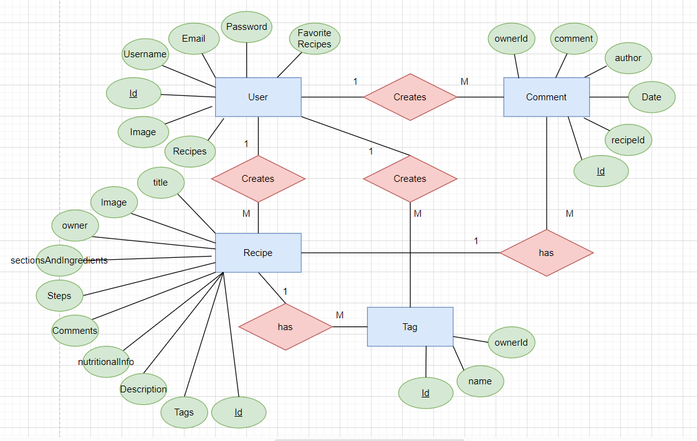

## Teaser (MS3)
Home Page Desktop

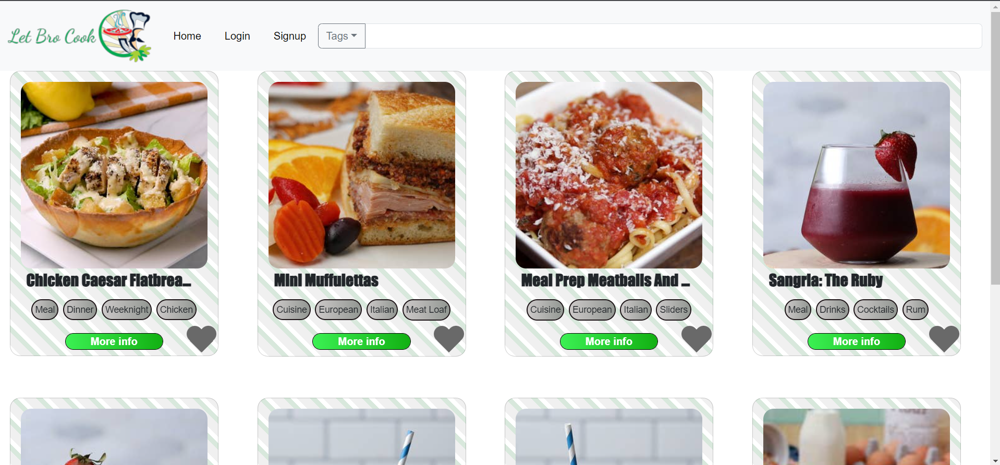

Home Page Ipad

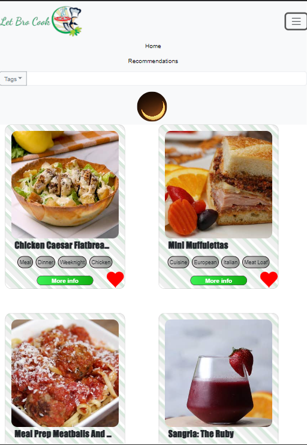

Home Page Mobile

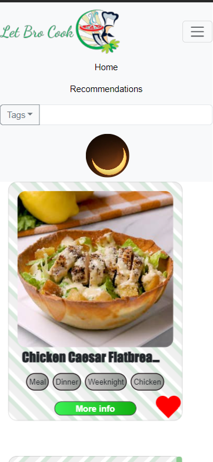

Signup page

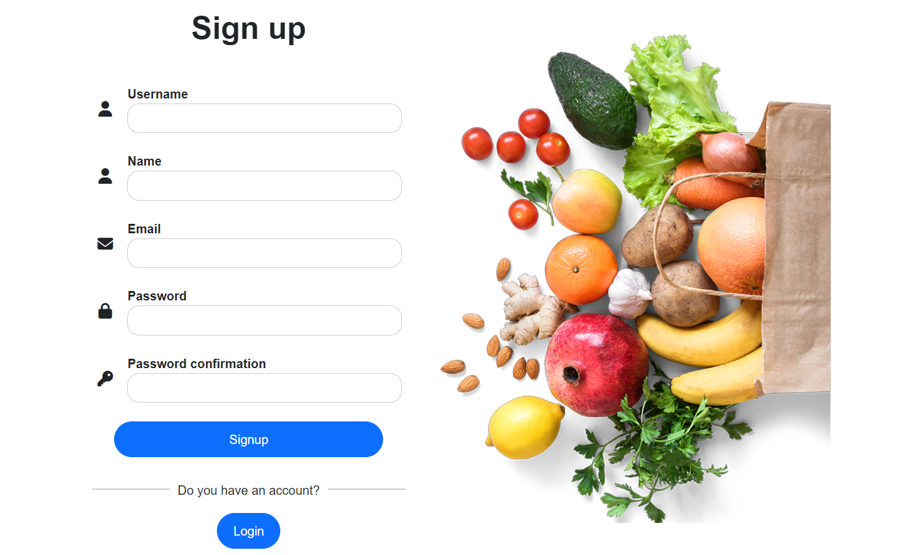

Login page

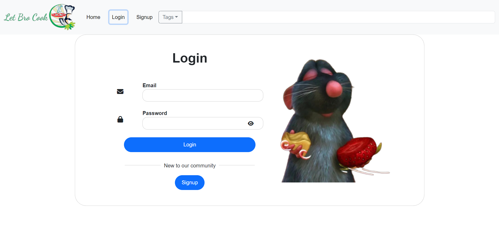

Create recipe Desktop

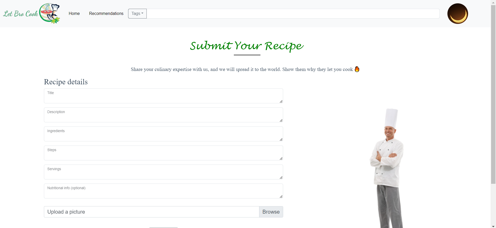

Edit profile

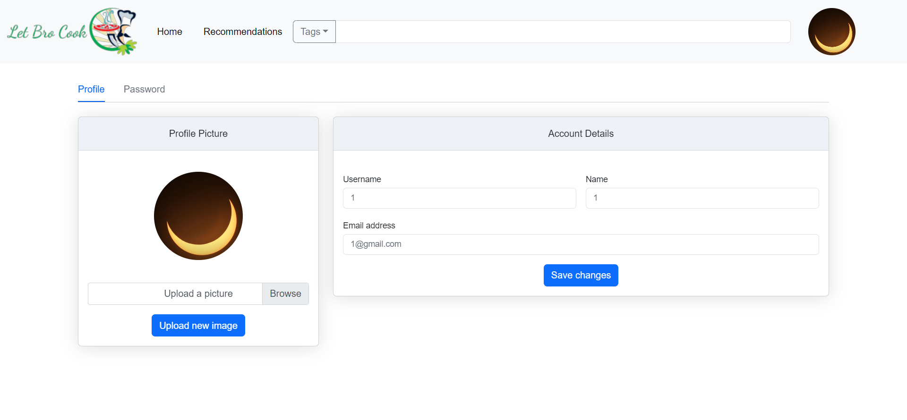

User security page

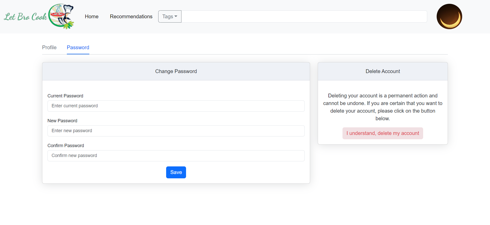

Create recipe Mobile

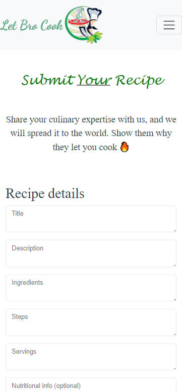

Backside of card

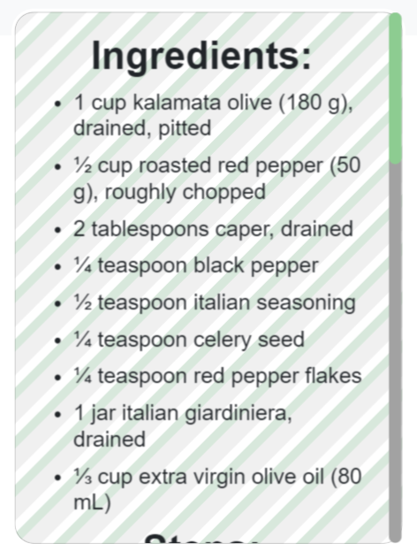

Card show comment button

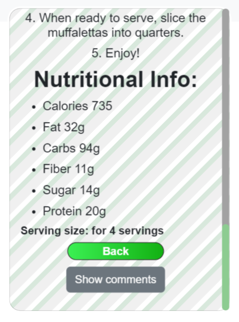

Card comment section

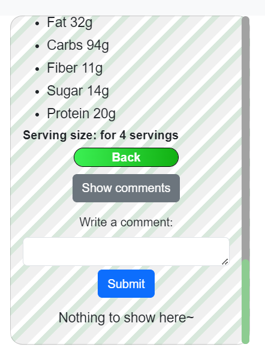

Card other people's comments

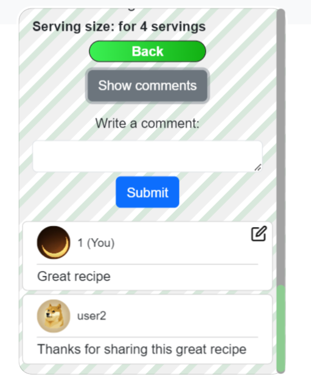

Card edit comment

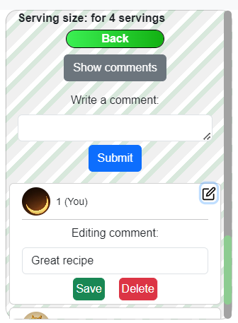
